# Repo for `"Modeling Chemical Reactions"` internship project

This repo re-implements the [GeoGNN](https://github.com/PaddlePaddle/PaddleHelix/tree/dev/apps/pretrained_compound/ChemRL/GEM) model from the paper - ["Geometry-enhanced molecular representation learning for property prediction"](https://www.nature.com/articles/s42256-021-00438-4) in PyTorch and DGL, and modifies the GeoGNN's downstream model and how the molecules are represented in the graphs, to accomodate reactions instead of single molecules, and to predict reaction-properties instead of molecular-properties.

My internship's presentation slides can be found at [`internship_presentation_slides.pdf`](internship_presentation_slides.pdf), which could server as a "background info" for this project; although it doesn't include the results from the my last few internship weeks as this was done before them.

<br>

# Reference papers

- Molecular-properties prediction using GeoGNN (aka GEM) model - ["Geometry-enhanced molecular representation learning for property prediction"](https://www.nature.com/articles/s42256-021-00438-4), [[Github repo](https://github.com/PaddlePaddle/PaddleHelix/tree/dev/apps/pretrained_compound/ChemRL/GEM)]

- Reaction properties prediction using CGR - ["Machine Learning of Reaction Properties via Learned Representations of the Condensed Graph of Reaction"][cgr_paper], [[Github repo](https://github.com/chemprop/chemprop)]

- An older reaction-properties paper preceding the above CGR paper - ["Deep Learning of Activation Energies"](https://pubs.acs.org/doi/10.1021/acs.jpclett.0c00500)

<br>

# Setup

To avoid bloating this repo with model checkpoints, all the checkpoints/training-logs are located in [another repo](https://github.com/EvitanRelta/reaction-geognn-lightning-logs), and this repo has a submodule to it at the directory - `lightning_logs`.

To download the checkpoint files in that submodule, simply initialise the submodule via:

```bash
git submodule init
git submodule update
```

<br>

The packages needed are found in `environment.yml`, which can be installed via:

```bash
conda env create -f environment.yml
conda activate dgl-geognn
```

<br>

Additionally, if u want to run the original [GeoGNN code](https://github.com/PaddlePaddle/PaddleHelix/tree/dev/apps/pretrained_compound/ChemRL/GEM) from the paper - ["Geometry-enhanced molecular representation learning for property prediction"](https://www.nature.com/articles/s42256-021-00438-4), the packages needed by them can be found in `paddlehelix_environment.yml`.

```bash
conda env create -f paddlehelix_environment.yml
conda activate paddlehelix
```

<br>

# Experiments and results

The below graphs are plotted in the `results.ipynb` file. The "v" numbers are the corresponding version numbers in the `lightning_log` directory for that model's checkpoint/training-logs (eg. `(v109)` refers the the logs at `lightning_log/version_109`).

The dashed lines are validation losses, solid lines are the training losses.

The datasets used are:

- `QM9` - Quantum chemical properties for small organic molecules. 
  - PyTorch `Dataset` - `geognn.qm9_dataset.QM9Dataset`
  - PyTorch-Lightning `LightningDataModule` - `geognn.data_modules.QM9DataModule` (random-split)

- `wB97X-D3` - Computational activation energies and enthalpies of formation for reactions at the ωB97X-D3/def2-TZVP level of theory. 
  - PyTorch `Dataset` - `reaction_geognn.datasets.Wb97Dataset.Wb97Dataset` (original dataset)
  - PyTorch-Lightning `LightningDataModule` - `reaction_geognn.data_modules.Wb97DataModule` \
  (fold-splits by the [CGR paper][cgr_paper], which **ONLY** has activation energies, and includes **reversed** reactions)

- `B97-D3` - Same as `wB97X-D3` but computed at the B97-D3/def2-mSVP level of theory.
  - PyTorch `Dataset` - (didn't code out sadly)
  - PyTorch-Lightning `LightningDataModule` - `reaction_geognn.data_modules.B97DataModule` \
  (fold-splits by the [CGR paper][cgr_paper], which **ONLY** has activation energies, and includes **reversed** reactions)

> **HOWEVER,** the `wB97X-D3` / `B97-D3` dataset used in the experiments below are **ALL** from **fold-split 0** (the fold-splits is defined/splitted by the [CGR paper][cgr_paper], downloadable [here](https://github.com/hesther/reactiondatabase/tree/main/data_splits)).

<br>

## Performance of superimposed-aggregation vs initial sum-pooling

The graph below is the:
- initial [sum-pooling downstream-head design](#initial-reaction-properties-head-architecture) vs the current [superimposed CGR aggregation with attention pooling](#reaction-properties-head-architecture)
- for reaction-property prediction on `wB97X-D3` fold-split 0 dataset
- with unstandardised RMSE training (solid line) and validation (dashed line) losses

From it, it can be concluded that the superimposed-aggregation significantly improved performance, and thus, all subsequent experiments uses this superimposed-aggregation.

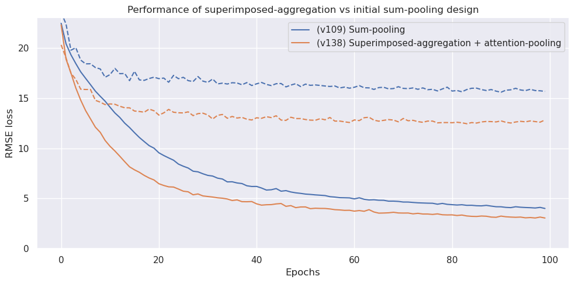

<br>

## Effects of pretraining on QM9 and/or B97-D3 datasets, before finetuning on wB97X-D3

For all pretrainings, early stopping with patience=3 (ie. stops training if validation loss doesn't decrease 3 epochs in a row).

Training losses are the solid lines, validation losses are the dashed lines.

<br>

### Impact of taking later epochs from QM9-pretraining

Here's the epoch picked for QM9-pretraining via early stopping (ignore the red dot for now):

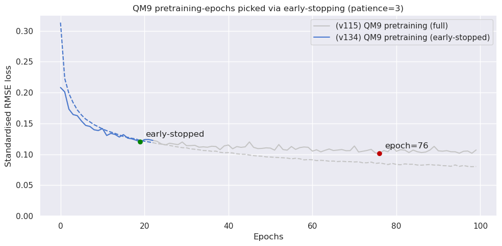

<br>

Here's the unstandardised RMSE training/validation losses when finetuning on `wB97X-D3` fold-split 0 dataset, compared to no-pretraining and when pretrained to a later epoch (epoch=76 as shown above).

From it, it can be concluded that taking a later epoch doesn't do much (seems to even slightly worsen performance on validation split).

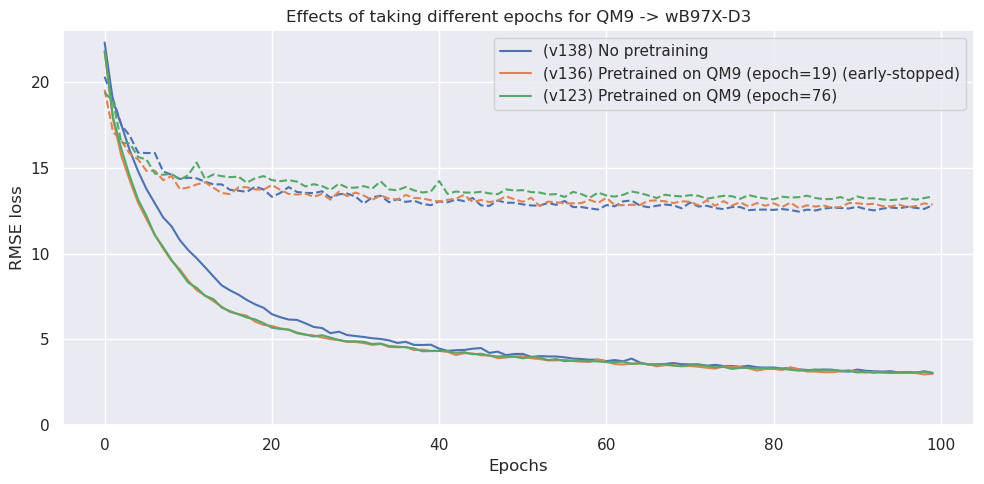

<br>

### Impact of taking later epochs from B97-D3-pretraining

Here's the epoch picked for B97-D3-pretraining via early stopping for both:
- pretraining a fresh model
- and pretraining using the encoder from a QM9-pretrained model (ignore this for now)

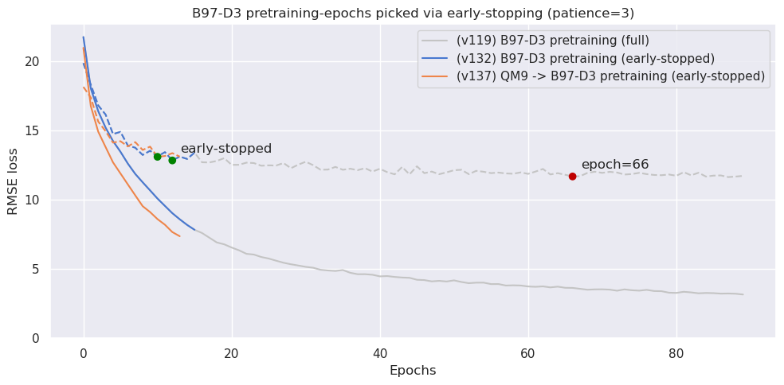

<br>

Here's the unstandardised RMSE training/validation losses when finetuning on `wB97X-D3` fold-split 0 dataset, compared to no-pretraining and when pretrained to a later epoch (epoch=66 as shown above).

From it, it can be concluded that taking a later epoch significantly improved performance on validation split. Perhaps it's because B97-D3 is much bigger (33k for B97-D3 vs 24k for wB97X-D3 with reversed reactions), and thus, have much more information to learn.

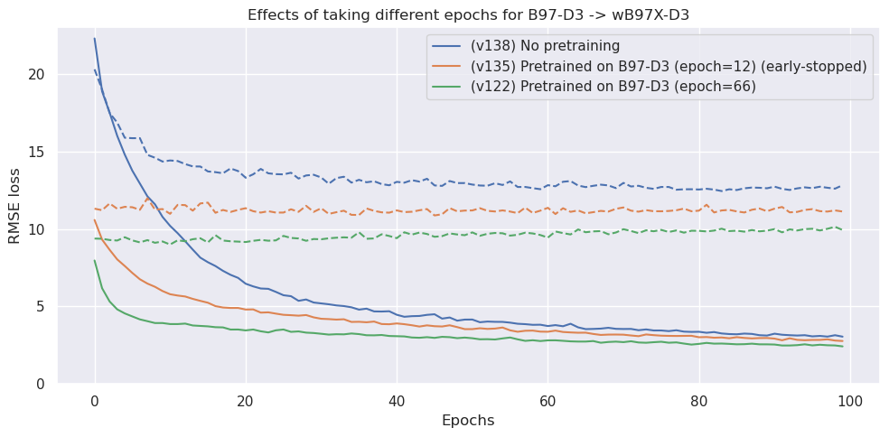

<br>

### QM9-pretrained vs B97-D3-pretrained vs QM9+B97-D3-pretrained

Here's the unstandardised RMSE training/validation losses when finetuning on `wB97X-D3` fold-split 0 dataset for:

- Pretrained on QM9, taking the GeoGNN-encoder, and finetuned on wB97X-D3
- Pretrained on B97-D3, finetuned on wB97X-D3
- Pretrained on QM9, then pretrained on B97-D3, finetuned on wB97X-D3

<br>

From it, it can be concluded that:

1. Pretraining on QM9 doesn't do much.
2. Pretraining on B97-D3 significantly improves performance.
3. The validation loss of B97-D3-pretrained model doesn't decrease during wB97X-D3-finetuning, perhaps due to B97-D3 being larger (33k for B97-D3 vs 24k for wB97X-D3 with reversed reactions).

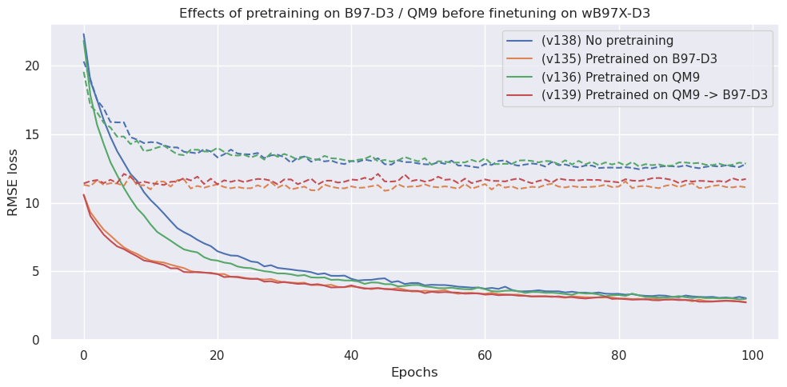

<br>

## Effects of different dropout rates

Here's the unstandardised RMSE training/validation losses when finetuning on `wB97X-D3` fold-split 0 dataset, using a B97-D3-pretrained model (epoch=66, as it's the best model so far).

From it, it can be concluded that increasing the dropout rate doesn't improve performance on the validation split.

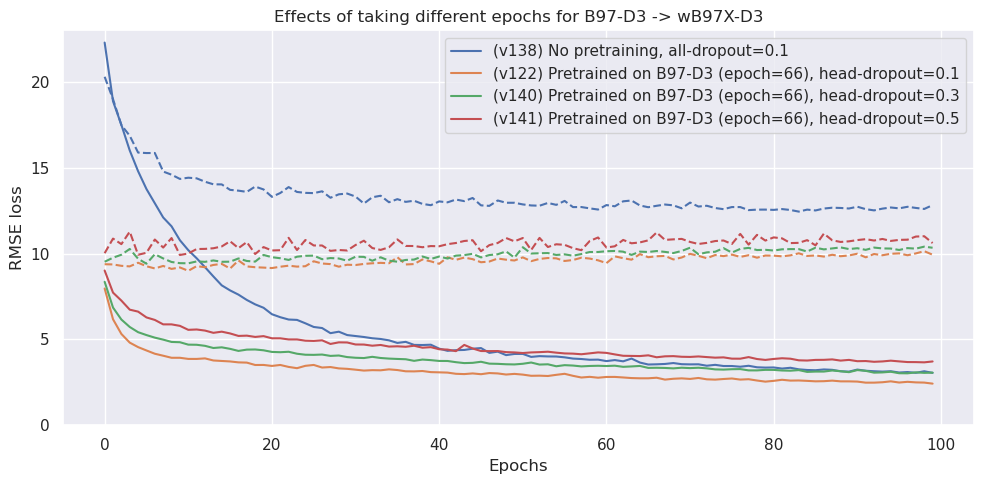

<br>

# Re-running the B97-D3 / QM9 pretrainings + wB97X-D3 finetunings

The scripts for re-running the B97-D3 / QM9 pretrainings, and then the wB97X-D3 finetunings are found in the `scripts` directory, but they need some setting up.

Here's the 7 scripts:

- `train_wb97xd3.sh` - train a fresh model on wB97X-D3 dataset without any pretraining.
- `pretrain_on_b97d3.sh` - pretrain a fresh model on B97-D3 dataset.
- `pretrain_on_qm9.sh` - pretrain a fresh **molecular-properties** model on QM9 dataset.
- `pretrain_qm9_on_b97d3.sh` - use a QM9-pretrained encoder (from `pretrain_on_qm9.sh`) with a fresh **reaction-properties** head, and pretrain on B97-D3 dataset.
- `finetune_b97d3_on_wb97xd3.sh` - finetune a B97-D3-pretrained model (from `pretrain_on_b97d3.sh`) on wB97X-D3 dataset.
- `finetune_qm9_on_wb97xd3.sh` - use a QM9-pretrained encoder (from `pretrain_on_qm9.sh`) with a fresh **reaction-properties** head, and finetune on wB97X-D3 dataset.
- `finetune_qm9_b97d3_on_wb97xd3.sh` - finetune a QM9-B97-D3-pretrained model (from `pretrain_qm9_on_b97d3.sh`) on wB97X-D3 dataset.

To run them, replace the below line in the `.sh` files to ur conda environment's python executable (which can be found by activating ur conda environment and running `which python` / `which python3`):

```sh
CONDA_PYTHON_PATH="/home/tzongzhi/anaconda3/envs/dgl-geognn/bin/python"
```

Then run the first set of scripts (ie. `train_wb97xd3.sh`, `pretrain_on_b97d3.sh`, `pretrain_on_qm9.sh`) via bash:

scripts via bash:

```bash
bash scripts/train_wb97xd3.sh
bash scripts/pretrain_on_b97d3.sh
bash scripts/pretrain_on_qm9.sh
```

Which will output the logs and checkpoints in the `lightning_logs` dir.

To do the finetuning (or pretraining a pretrained model), u'll need to update this checkpoint path to that of the newly generated pretraining checkpoints:

```bash
--pretrained_chkpt_path "/home/tzongzhi/mygnn/lightning_logs/version_132/checkpoints/epoch=12-std_val_loss=4.33e-01.ckpt"

# or, for the QM9-pretrained checkpoints:
--pretrained_encoder_chkpt_path "/home/tzongzhi/mygnn/lightning_logs/version_134/checkpoints/epoch=19-std_val_loss=1.20e-01.ckpt"
```

Then run:

```bash
bash scripts/pretrain_qm9_on_b97d3.sh
bash scripts/finetune_b97d3_on_wb97xd3.sh
bash scripts/finetune_qm9_on_wb97xd3.sh
```

Then finally, update the `--pretrained_chkpt_path` path for `finetune_qm9_b97d3_on_wb97xd3.sh` and run that last finetuning.

<br>

# Features used

The features can be found in the files:

- Atom features: `geognn/features/atom_features.py`
- Bond features: `geognn/features/bond_features.py`
- Bond-angle features: `geognn/features/bond_angle_features.py`

<br>

# State representation

## For molecules

- Discrete features (eg. single/dbl bond, atomic number) are label-encoded into `int64` tensors.

  - The label-encoding reserves value `0` for the absence of features (eg. when the bond doesn't exist, but u still need to fill the feature tensor with something)

- Continuous numerical features (eg. bond length, bond angle) are stored in `float32` tensors.

- The graphs are supposed to be undirected-graphs (as molecular bonds have no "direction"), but DGL represents undirected graphs as bidirected.

  <p align="center">
    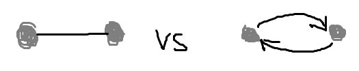
  </p>

  Thus, on the `DGLGraph` instances the edges/edge-features are duplicated (ie. 2 directed edges to represent an undirected edge).

  The duplicate edges are interleaved with the original edges. For example: `[edge1, edge1_dup, edge2, edge2_dup, ...]`

<br>

## Changes to accommodate reactions

- Since reactions have (at least) 2 molecules (ie. reactant and product), the reactant and product are represented as **disconnected graphs** in a single `DGLGraph` instance.

  If thrs multiple reactants/products, each reactant/product molecule are also represented as disconnected graphs.

- The reactant's nodes/edges are ordered first, then the product's. For example: `[reactant1, reactant2, reactant3, product1, product2, product3]`

  To facilitate separating them, each atom-node has a bool-tensor feature at `.ndata["_is_reactant"]`, which can be used as a mask for separation.

- The reaction's SMARTS string (should) have atom-mapping, and thus, the atom-nodes in the atom-bond graphs are ordered in the same order as the atom-map.

<br>

## Graphs

For each reaction SMARTS string, the model takes in 3 graphs (molecular-properties take only have the first 2 graphs):

- **Atom-bond graph:** Nodes are atoms, edges are bonds between the 2 atoms. Has atom and bond features.
- **Bond-angle graph:** Nodes are bonds, edges are bond-angles formed between 2 bonds. Has only bond-angle features (bond features are only on the atom-bond graph to avoid duplicating info).
- **Superimposed atom-bond graph:** (only for reaction-properties) Nodes are atoms, edges are bonds. Has only bond features. Contains bonds from both reactants and products (ie. superimposed), where each edge has bond features from both reactants and products, prefixed with an `r_` and `p_` respectively (ie. `.edata["r_FEAT_NAME"]` / `.edata["p_FEAT_NAME"]`). If the bond exists on the reactant/product but not on the other, the their feature-tensor in `.edata` will be a zero-tensor.

<br>

# Architecture

## GeoGNN-encoder architecture

Below is the architecture of a `geognn.encoder.GeoGNNModel` (ie. the encoder) instance with 2 `geognn.encoder.GeoGNNLayer` layers:

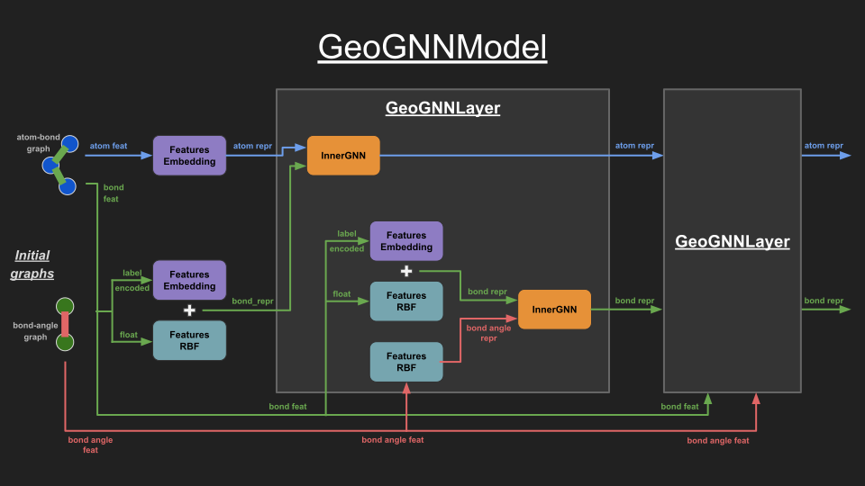

<br>

## Molecular-properties head architecture

For molecular-properties prediction, the downstream-model is the `geognn.model.DownstreamModel` class.

The head is just a multi-layer perceptron (MLP) with dropout (ie. the `DropoutMLP` class), along with a normalisation layer (ie. `torch.nn.LayerNorm`). The batched atom-representations (ie. the node-representations) is average-pooled into a batched graph-representations tensor of size `(num_batches, embed_dim)`, and fed to the normalisation and MLP layers.

<br>

## Reaction-properties head architecture

For reaction-properties prediction, the downstream-model is the `reaction_geognn.model.ReactionDownstreamModel` class.

The head takes the atom-representations (ie. the node-representations) and for each atom-representation in the batch, it:

- split them into reactants' and products' atom-representations (each of size `(num_atoms, embed_dim)`)
- get the difference (ie. `diff_repr = product_repr - reactant_repr`) (size `(num_atoms, embed_dim)`)
- concatenate reactant representation with diff (ie. `concat([reactant_repr, diff_repr], dim=1)`) (size `(num_atoms, 2 * embed_dim)`)
- Feed the concatenated representation to a GNN (ie. `reaction_geognn.model.AggregationGNN`) to aggregate the atom and bond representations using the superimposed atom-bond graph. (still size `(num_atoms, 2 * embed_dim)`)
- Perform attention-pooling to get graph-representation. (size `(2 * embed_dim, )`)
- Normalise
- Feed into MLP

This reactant-diff concat representation was inspired by the [CGR paper][cgr_paper], which did something similar, and which claimed that concatenating reactant with diff is the most optimal among other combinations (eg. product-diff).

<br>

### Initial reaction-properties head architecture

The initial head design was simply to sum-pool the product-reactant difference by:

- split them into reactants' and products' atom-representations (each of size `(num_atoms, embed_dim)`)
- get the difference (ie. `diff_repr = product_repr - reactant_repr`) (size `(num_atoms, embed_dim)`)
- Sum-pool to get graph-representation. (size `(embed_dim, )`)
- Normalise
- Feed into MLP

The branch `reaction-sum-pool` implements this older head architecture, which you'll need to checkout to to load the checkpoint in `lightning_logs/version_109` (which used this older head).

<br>

# Timeline (ie. things that I've done)

1. Recoded GeoGNN from GeoGNN's code (that uses `paddle`) to `PyTorch` + `DGL`.
1. Redesign state representation and downstream head to accommodate reactions instead of single molecules.
1. Convert code to use PyTorch lightning, for cleaner/simpler code.
1. Tested different embedding dimensions, 32, 128, 256 (finally used 256 as it's close to what the CGR paper used - 300).
1. Verified that the model has the capacity to represent the wB97X-D3 dataset. This is done by training on a subset of the dataset (ie. 1k, 5k, 10k, 16k) and checking that the training loss eventually converges to ~0 (ie. overfitting).
1. Tested a few different GNNs, eg. GAT, GINEConv, by replacing SimpleGIN
1. Changed pooling/aggregation method, from the initial design of sum-pooling, to attention pooling, to superimposed CGR GNN aggregation with bond feats + attention pooling.
1. Ran experiments to explore the effects of pretraining on B97-D3 and QM9 datasets, for finetuning on wB97X-D3.
1. Ran experiments to explore the effects of using different head dropout, using the best model we've obtained so far (pretrained on B97-D3 epoch=66).

<br>

# Possible things to try in future

- Re-run QM9-pretrained, wB97X-D3-finetuning experiments with varying subsets of the wB97X-D3 dataset (eg. 1k, 5k, 10k, 15k, 19k out of the full 19k wB97X-D3 80%-train-split), then plotting the dataset-size against the lowest validation loss achieved, to see the effects of QM9-pretraining as the finetuning dataset grows in size.

- Train on 2 tasks - wB97X-D3's activation energy and enthalpy, similar to that done by the paper - ["Deep Learning of Activation Energies"](https://pubs.acs.org/doi/10.1021/acs.jpclett.0c00500) at section S10 of their [supporting info](https://pubs.acs.org/doi/suppl/10.1021/acs.jpclett.0c00500/suppl_file/jz0c00500_si_001.pdf). I've only trained on wB97X-D3's activation energy, but that paper mentioned that training activation energy + enthalpy significantly improved performance.

  Although, the [CGR paper][cgr_paper] didn't mention using enthalpy, and their fold-split wB97X-D3 dataset files (downloadable [here](https://github.com/hesther/reactiondatabase/tree/main/data_splits)) also did not include enthalpy. (hence u'll need to map the reaction SMARTS strings in the fold-splits to the enthalpy in the original wB97X-D3 dataset to get the enthalpy values)

- Hyper-parameter tuning of:
  - learning rate (the [CGR paper][cgr_paper] used a lr scheduler)
  - dropout rate
  - embedding dimension
  - number of GNN layers
  - all hidden sizes in the GNN / downstream model (which may not be configurable from the classes' constructors)

- Freezing the weights of encoder, and finetuning just the downstream-model's head.

- Using different learning rates for the head compared to the encoder, or for finetuning compared to pretraining.

- Learnable RBF? (currently it's using a RBF layer with predefined centers)

- Use atom/bond features from [CGR paper][cgr_paper] instead (I believe they used atomic mass, a feature that was cut out in GeoGNN and thus in this repo)

- Modifying the aggregating GNN (ie. `reaction_geognn.model.AggregationGNN`) to aggregate the bond-angle info on a new superimposed bond-angle graph, before doing the currently-implemented aggregation on the superimposed atom-bond graph (so as to account for the bond-angle info).

- Modifying the GeoGNN encoder to propagate the bond-representation between the bond-bond-angle GNN layers, as proposed by the GeoGNN paper (but not what they coded).

  Currently, it's re-embedding the initial bond/bond-angle features instead of propagating, which was what the GeoGNN's code did.

  These 2 architectures are shown below:

  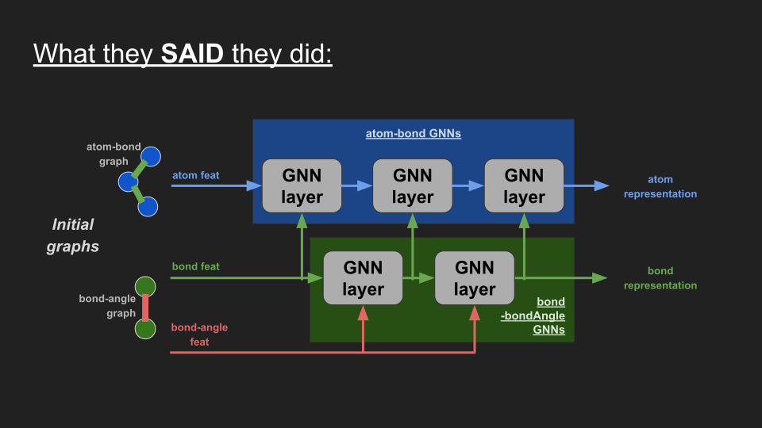

  <p align="center">vs</p>

  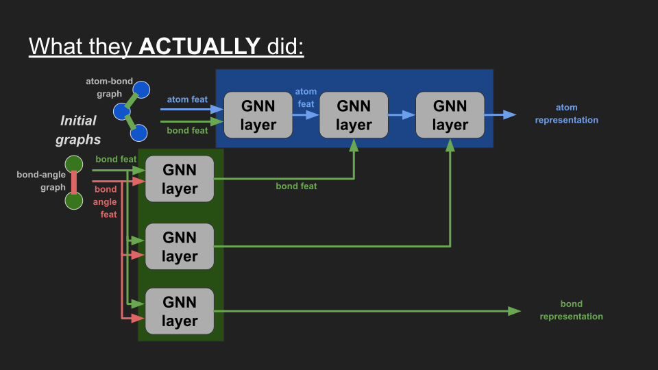


[cgr_paper]: https://pubs.acs.org/doi/10.1021/acs.jcim.1c00975
